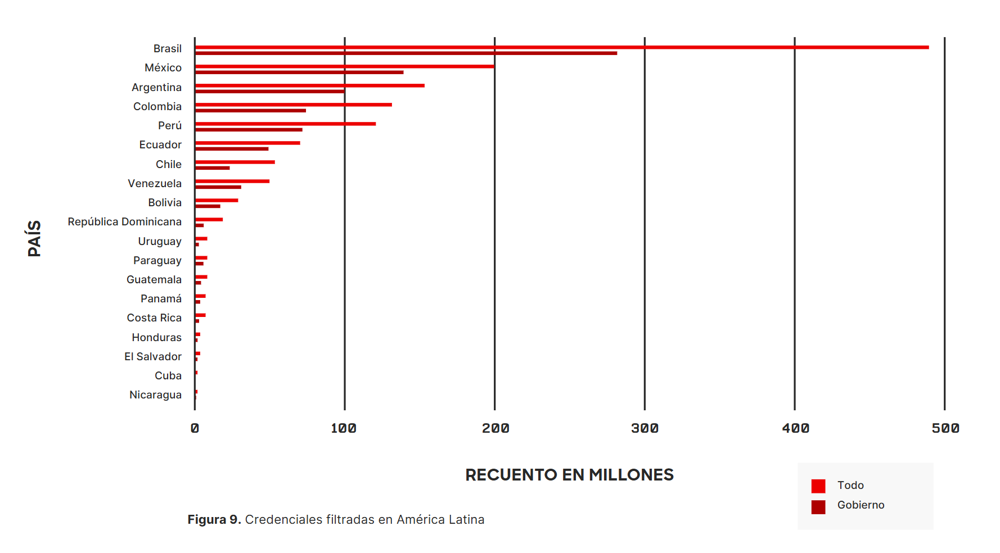

# Contexto regional y relevancia del problema

## Transformación digital en América Latina

En los últimos años, América Latina ha experimentado un crecimiento sostenido en la adopción de tecnologías digitales, particularmente en el uso de servicios cloud, arquitecturas basadas en microservicios y plataformas de orquestación como Kubernetes. Este proceso de transformación digital ha sido impulsado tanto por organizaciones privadas como por instituciones públicas, con el objetivo de mejorar la escalabilidad, disponibilidad y eficiencia de los sistemas tecnológicos.

Sin embargo, este crecimiento ha traído consigo un incremento significativo en la complejidad de los entornos tecnológicos. La distribución de servicios, la comunicación entre múltiples componentes y la necesidad de gestionar identidades y credenciales de forma dinámica introducen nuevos desafíos en materia de seguridad.

En este contexto, el uso de prácticas como DevOps y GitOps ha permitido automatizar la gestión de infraestructura y aplicaciones mediante repositorios de código como fuente de verdad. No obstante, esta automatización también incrementa la exposición de configuraciones sensibles, especialmente cuando credenciales y secretos son gestionados de forma inadecuada dentro de estos flujos.

## Incremento de amenazas y desafíos de seguridad

Paralelamente, diversos estudios han evidenciado que América Latina se ha consolidado como una de las regiones más afectadas por incidentes de ciberseguridad a nivel global, a pesar de presentar niveles de preparación relativamente bajos en comparación con otras regiones. Este fenómeno se ve acentuado por el alto nivel de conectividad digital, que incrementa significativamente la superficie de ataque disponible [1].

En este contexto, el crecimiento en la adopción de arquitecturas basadas en APIs y servicios distribuidos ha ampliado considerablemente los vectores de ataque. Las APIs, al ser un componente fundamental en la comunicación entre aplicaciones, se han convertido en un objetivo prioritario para los atacantes, quienes buscan explotar vulnerabilidades para acceder a datos sensibles o interrumpir servicios críticos [2].

De acuerdo con reportes recientes, la región ha experimentado un incremento significativo en ataques dirigidos a aplicaciones web y APIs, pasando de cientos de miles de incidentes a miles de millones en un corto periodo de tiempo, lo que evidencia una rápida evolución en la sofisticación y escala de las amenazas [2].

Además de estos vectores de ataque, la exposición de credenciales se ha convertido en uno de los principales riesgos de seguridad. De acuerdo con informes recientes de inteligencia de amenazas, durante el año 2024 se identificaron más de mil millones de credenciales filtradas asociadas a usuarios y organizaciones en América Latina, lo que evidencia la magnitud del problema en la región [4].

Estas credenciales no solo representan un incidente aislado, sino que forman parte de un ecosistema estructurado de cibercrimen. Diversos reportes han identificado la existencia de mercados clandestinos en los cuales las credenciales comprometidas son recolectadas, comercializadas y utilizadas como medio de acceso a sistemas y redes.

En este contexto, destacan actores conocidos como *brokers de acceso*, quienes obtienen y venden accesos a redes comprometidas, facilitando la ejecución de ataques como ransomware, robo de información y accesos no autorizados a infraestructuras críticas [4]. Este modelo evidencia que la explotación de credenciales es una actividad sistemática y rentable dentro del ecosistema de amenazas.

Adicionalmente, el informe de ciberseguridad 2025 del Banco Interamericano de Desarrollo y la Organización de los Estados Americanos señala que la región enfrenta desafíos estructurales relacionados con la madurez en seguridad, incluyendo limitaciones en recursos, talento especializado y coordinación entre sectores [3].

## Seguridad en el despliegue de aplicaciones en Kubernetes

El despliegue de aplicaciones web distribuidas en entornos basados en Kubernetes se ha convertido en una práctica común para organizaciones que buscan escalabilidad, eficiencia y alta disponibilidad. Sin embargo, la gestión de la seguridad en estos entornos continúa siendo un desafío crítico, particularmente en lo relacionado con la administración de secretos y credenciales necesarios para el funcionamiento y la comunicación entre los componentes desplegados.

Si bien existen soluciones avanzadas y servicios externos ofrecidos por proveedores cloud, estos suelen implicar costos elevados, mayor complejidad operativa y dependencia tecnológica de terceros. Esta situación puede representar una barrera para organizaciones en desarrollo, instituciones públicas o pequeñas y medianas empresas.

Como resultado, muchas organizaciones optan por mecanismos alternativos que no cumplen con buenas prácticas de seguridad, como el almacenamiento de credenciales en archivos de configuración o repositorios de código, lo que incrementa el riesgo de exposición de información sensible.

## Gestión de secretos como punto crítico

Uno de los aspectos más críticos dentro de este contexto es la gestión de credenciales y secretos. En muchos casos, las organizaciones continúan utilizando mecanismos tradicionales, como el almacenamiento de credenciales en archivos de configuración, variables de entorno o repositorios de código.

Este problema ha sido identificado en la literatura reciente como *secrets sprawl*, donde la proliferación descontrolada de credenciales en múltiples puntos del sistema dificulta su control y aumenta la probabilidad de filtraciones.

Adicionalmente, estudios recientes han demostrado un incremento sostenido en la exposición de secretos en repositorios de código y pipelines de integración continua, lo que evidencia debilidades en las prácticas actuales de gestión de credenciales.

Tabla 1. Exposición de secretos en repositorios de código (2022–2025)

| Año | Secretos expuestos | Crecimiento (%) | Tipo de secreto predominante |
|-----|--------------------|----------------|------------------------------|
| 2022 | 10,000,000 | — | Credenciales de bases de datos |
| 2023 | 12,778,599 | +27.79% | API Keys (principalmente Google API Keys) |
| 2024 | 23,770,171 | +86.03% | Credenciales de servicios y bases de datos |
| 2025 | 28,649,024 | +20.53% | Credenciales cloud y llaves de servicios (incluyendo sistemas de IA) |

Fuente: Reportes de GitGuardian (2023, 2024, 2025, 2026)

Asimismo, el incremento en el uso de identidades no humanas —como cuentas de servicio, pipelines de CI/CD y microservicios— ha intensificado la dependencia de secretos para la autenticación entre componentes, ampliando significativamente la superficie de ataque en entornos distribuidos.

## Limitaciones en la adopción de controles avanzados

Adicionalmente, factores como la limitada disponibilidad de recursos, la complejidad de las herramientas de seguridad avanzadas y la falta de especialización técnica dificultan la adopción de modelos de seguridad más robustos en muchas organizaciones de la región.

Esta situación es especialmente relevante en instituciones públicas y pequeñas y medianas empresas, donde la implementación de soluciones de seguridad compite con otras prioridades operativas.

## Necesidad de enfoques adaptativos y automatizados

En este contexto, se hace evidente la necesidad de adoptar enfoques que fortalezcan la seguridad sin incrementar significativamente la complejidad operativa. Modelos como Zero Trust, junto con prácticas de automatización como GitOps, ofrecen una alternativa viable al promover controles basados en identidad, acceso granular y verificación continua.

No obstante, la implementación efectiva de estos enfoques requiere una integración coherente entre identidad, control de acceso y gestión de secretos, lo que continúa siendo un desafío en entornos Kubernetes.

## Relevancia para la investigación propuesta

En este contexto, el desarrollo de un marco de referencia orientado a la gestión automatizada y segura de secretos en entornos Kubernetes responde tanto a una necesidad técnica como a un problema real evidenciado en la región.

Este enfoque busca reducir la brecha entre la complejidad de los sistemas actuales y la capacidad de las organizaciones para gestionarlos de forma segura, promoviendo soluciones replicables, accesibles y alineadas con estándares modernos de seguridad.

## Referencias

**Renzullo Narváez, J. A., & Hall, M. M.**  
*Cybersecurity Developments in Latin America: Problems, Models, and Cooperation Channels.*  
DigiTraL Policy Study No. 7/2025, GIGA, 2025.  
Disponible en: [Ver documento](https://pure.giga-hamburg.de/ws/files/54047533/DigiTraL-08-Renzullo-Hall.pdf)

**Akamai Technologies.**  
*API Cyberattacks: A Growing Threat for Organizations in Latin America.* 2024.  
Disponible en: [Leer artículo](https://www.akamai.com/blog/security/api-cyberattacks-growing-threat-organizations-latin-america)

**Inter-American Development Bank (IDB) & Organization of American States (OAS).**  
*2025 Cybersecurity Report: Vulnerability and Maturity Challenges to Bridging the Gaps in Latin America and the Caribbean.* 2025.  
Disponible en: [Ver informe](https://publications.iadb.org/en/publications/english/viewer/2025-Cybersecurity-Report-Vulnerability-and-Maturity-Challenges-to-Bridging-the-Gaps-in-Latin-America-and-the-Caribbean.pdf)

**CrowdStrike.**  
*Informe sobre el panorama de amenazas en América Latina 2025.*
Disponible en: [Ver informe](https://www.crowdstrike.com/es-latam/resources/reports/crowdstrike-2025-latin-america-threat-landscape-report/)

**GitGuardian.**   
*State of Secrets Sprawl Report 2023.*  
Disponible en: https://www.gitguardian.com/state-of-secrets-sprawl-report-2023

**GitGuardian.**   
*State of Secrets Sprawl Report 2024.*  
Disponible en: https://www.gitguardian.com/state-of-secrets-sprawl-report-2024

**GitGuardian.**   
*State of Secrets Sprawl Report 2025.*  
Disponible en: https://www.gitguardian.com/state-of-secrets-sprawl-report-2025

**GitGuardian.**   
*State of Secrets Sprawl Report 2025.*  
Disponible en: https://www.gitguardian.com/state-of-secrets-sprawl-report-2026