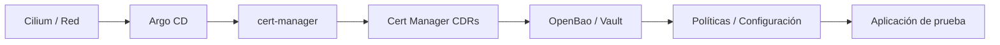

# Proceso de bootstrap

Este proceso corresponde a la preparación del entorno de implementación, en la cual se establecen los componentes base necesarios para el funcionamiento del modelo propuesto. Esta fase es indispensable debido a que varios de los componentes de la arquitectura presentan dependencias operativas que deben cumplirse para asegurar el correcto funcionamiento del sistema.

En primer lugar, se dispone de un clúster de Kubernetes funcional como base de ejecución. Sobre este entorno se implemetnan los componentes resposables de la automatización, la conectividad y seguridad base. Seguidamente se despliegan los servicios encargados de la emisión de certificados, los componentes previos a la configuración de la plataforma de secretos y por ultimo el gestor de los mismos.

El bootstrap está pensando de forma progesiva tal que cada componente esté disponible antes de habilitar dependencias superiores sin depender del autoheal del motor de GitOps. Esto con el fin de reducir los fallos de inicialización y facilitar la trazabilidad del proceso de implementación inicial.

## Inicialización del clúster de Kubernetes.

La implementación de este modelo está pensado en ser independiente del entorno de Kubernetes en el que se va a inicializar, sin embargo, es preferible tanto por diseño y seguridad, que el gestor de secretos se implemente en un cluster aislado y configurado desde cero.

### Kind

Para inicializar un clúster en kind de manera basica y comptible con Cilium, se propone el siguiente archivo de configuración:

```yaml
kind: Cluster
apiVersion: kind.x-k8s.io/v1alpha4
name: secure-cluster
networking:
  disableDefaultCNI: true
  kubeProxyMode: none
nodes:
  - role: control-plane
  - role: worker
```  

### K3S

Para inicializar un clúster con K3s de manera basica y comptible con Cilium, se propone el siguiente script:

```bash
curl -sfL https://get.k3s.io | sh -s - server \
  --flannel-backend=none \
  --disable-network-policy \
  --disable traefik \
  --disable servicelb

mkdir -p ~/.kube
sudo cp /etc/rancher/k3s/k3s.yaml ~/.kube/config
sudo chown $USER:$USER ~/.kube/config
chmod 600 ~/.kube/config
```  

Una vez aplicado este archivo de script, el clúster tendrá listo un nodo de plano de control para comenzar la inicialización de la plataforma de gestión de secretos.

## Despliegue del motor de GitOps

Esta implementación utiliza por defecto el motor de GitOps [ArgoCD](https://argo-cd.readthedocs.io/en/stable/) por lo que el manejo de dependecias y definición de "aplicaciones" para la gestión de componentes y recursos está adaptado a esta herramienta especifica. 

Existen distintas maneras de inicializar ArgoCD, sin embargo, la manera mas sencilla y recomendada es la ejecución de los comandos:

```bash
chmod +x bootstrap/kind/03-install-argocd.sh
./bootstrap/scripts/03-install-argocd.sh
```

La documentación oficial de ArgoCD provee mas detalles acerca de la instalación inicial [ArgoCD Getting Started](https://argo-cd.readthedocs.io/en/stable/getting_started/)

### Configurar ArgoCD
Configurar acceso:

El primer paso recomendado es accerder a la UI de ArgoCD, ingresar con las credenciales presentadas por el resultado del script y cambiar la contraseña de administración (se pueden asignar roles y usuarios mas adelante).

Configurar repositorio (para este caso se utiliza la url HTTPS del repo de Gitlab, de igual manera puede cambiarse mas adelante):

Crear un token personal y granular con los permisos para leer el repo, no se neceita de mas.
Reemplazar las variables y ejecutar el siguiente comando en el cluster:

```bash

    kubectl create secret generic repo-gitops -n argocd --from-literal=type=git --from-literal=url=https://gitlab.com/gotouchcr/opendid/did-infrastructre/opendid-vault/core-vault.git --from-literal=username=<username> --from-literal=password=<Token>

    kubectl label secret secret repo-gitops -n argocd argocd.argoproj.io/secret-type=repository
```

Una vez realizada la configuración de ArgoCD se puede continuar con el bootstrap de las applicaciones.

## Sincronización de componentes

Una vez instalado ArgoCD, es posible comenzar con la instalación de los componentes del sistema. Por defecto, cada aplicación de ArgoCD relacionada a un componente del sistema como cert-manager o vault, se encuentra bajo la carpeta argocd/applications, las cuales están diseñadas para ser ejecutadas en un orden especifico. Dicho orden recomendado se representa de la siguiente manera:



Cada aplicación posee la definición de una anotación de ArgoCD que permite definir el orden en el que se sincronizará con el clúster de Kubernetes, de esta forma es posible mantener el order de instalación inicial y la aplicación del patrón Apps-Of-Apps en el cual la ejecución de una aplicación de ArgoCD es capaz de manejar la ejecución de las demás.

```yaml
  annotations:
    argocd.argoproj.io/sync-wave: "1"
```

Para mas detalles sobre el uso de sync-waves se puede referir al apartado [sync-waves](https://argo-cd.readthedocs.io/en/stable/user-guide/sync-waves/) de la documentación oficial de ArgoCD.

Sin embargo, tambien es posible realizar la instalación inicial mediante la ejecución de cada aplicación de ArgoCD directamente en el clúster con el comando:

```yaml
kubectl apply -f mi-app.yaml -n argocd
```