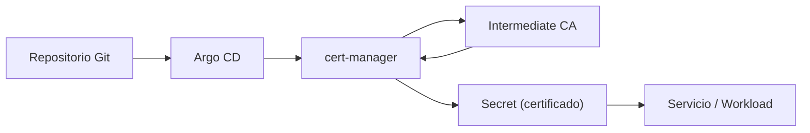

# Implementación de la gestión de certificados

La gestión de certificados es un componente fundamental dentro de la arquitectura propuesta, ya que proporciona los mecanismos de confianza entre los distintos elementos del sistema, y asegura las comunicaciones mediante el uso de criptografía. Para esta implementación, se incorporó **cert-manager** como solución para la automatización del ciclo de vida de certificados dentro del entorno de Kubernetes.

## Rol dentro de la arquitectura

Dentro de la arquitectura de referencia, cert-manager se ubica en la capa de seguridad e identidad, actuando como el componente encargado de gestionar la emisión y renovación de certificados digitales utilizados por los servicios y clientes consumidores del gestor de secretos.

Su integración permite:

- Establecer comunicaciones seguras mediante TLS.
- Proporcionar identidades verificables a los servicios.
- Habilitar mecanismos de autenticación basados en certificados (cert auth para vault).

De esta forma, cert-manager opera como un intermediario entre la configuración declarativa definida en Git y la infraestructura de certificados utilizada en el clúster.

## Modelo de confianza basado en PKI jerárquica

La arquitectura de certificados implementada se basa en un modelo jerárquicO compuesto por:

- Una autoridad certificadora raíz (Root CA) offline.
- Una autoridad certificadora intermediaria (Intermediate CA) utilizada para la emisión de certificados.
- Cert-Manager como componente encargado de orquestar las solicitudes de certificados.

La Root CA se mantiene aislada del entorno implementado, con el fin de minimizar su exposición. A partir de dicha Root CA, se genera una autoridad intermedia que se utiliza dentro del Clúster para firmar certificados de tls y cliente consumidor.

## Gestión declarativa de certificados

Siguiendo los principios de GitOps, la emisión de certificados se gestiona declarativamente con recursos definidos en el repositorio de Git. En este modelo, el repositorio contiene únicamente el estado deseado de certificados mediante CDRs como Issuer y Certificate.

Estos recursos son sincronizados automáticamente al clúster mediante el motor GitOps, donde cert-manager se encarga de procesarlos y coordinar la emisión de certificados a través de la autoridad intermedia configurada como Issuer.

Este enfoque permite mantener la coherencia con los principios de GitOps, y al mismo tiempo se preservan las buenas prácticas de seguridad en la gestión de información sensible.

!!! nota

    Es importante destacar que el repositorio GTI no almacena el material criptográfico generado, como las claves privadas o los certificados emitidos. Dichos elementos son creados dentro del clúster y almacenados en recursos protegidos como Secrets, evitando la exposición de los mismos a cierto nivel.

## Flujo de emisión de certificados

El proceso de emisión de certificados dentro del entorno sigue un flujo automatizado gestionado por cert-manager.

El flujo inicia con la definición declarativa del certificado mediante un CDR en el repositorio Git. Una vez sincronizada la configuración  en el clúster, cert-manager procesa la solicitud y la envía a la autoridad certificadora intermedia. El certificado emitido es almacenado de forma segura y asociado al servicio correspondiente.

## Uso de certificados en la arquitectura

Los certificados emitidos dentro del entorno cumplen múltiples funciones dentro de la arquitectura:

- Protección del gestor de secretos y sus comunicaciones mediante TLS

- Establecer canales de comunicación seguros.

- Soporte para autenticación basada en identidad en el gestor de secretos.

En particular, los certificados son utilizados para asegurar el acceso al gestor de secretos, permitiendo que únicamente los clientes consumidores con identidades válidas puedan autenticarse y solicitar credenciales.

# Consideraciones de seguridad

La implementación de este modelo introduce una serie de consideraciones clave:

- La autoridad raíz se mantiene fuera del entorno operativo para minimizar su exposición.

- La autoridad intermedia limita el impacto de posibles compromisos dentro del clúster.

- El material criptográfico no se almacena en el repositorio Git.

- La rotación automática reduce la persistencia de credenciales.

- La autenticación basada en certificados fortalece el modelo Zero Trust.

Estas medidas permiten establecer una infraestructura de confianza robusta y alineada con buenas prácticas de seguridad.