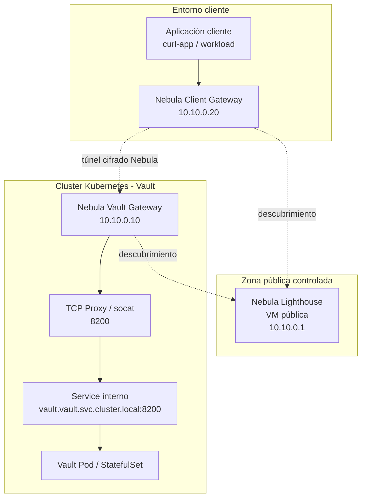
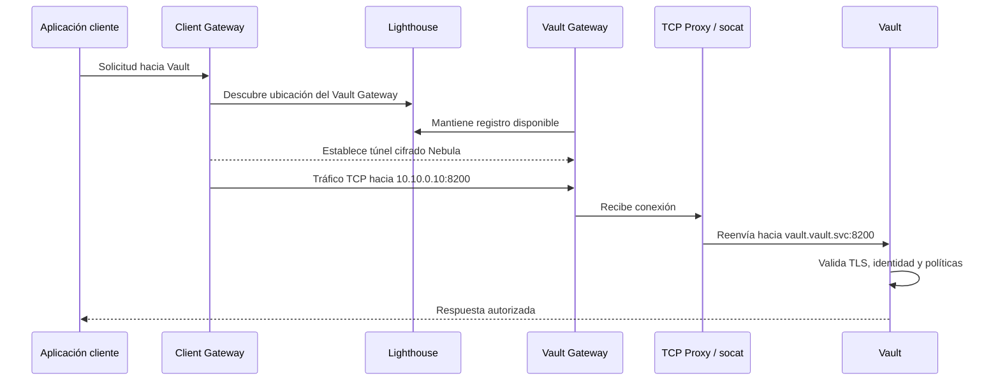
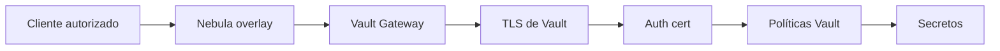
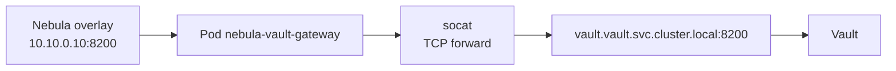
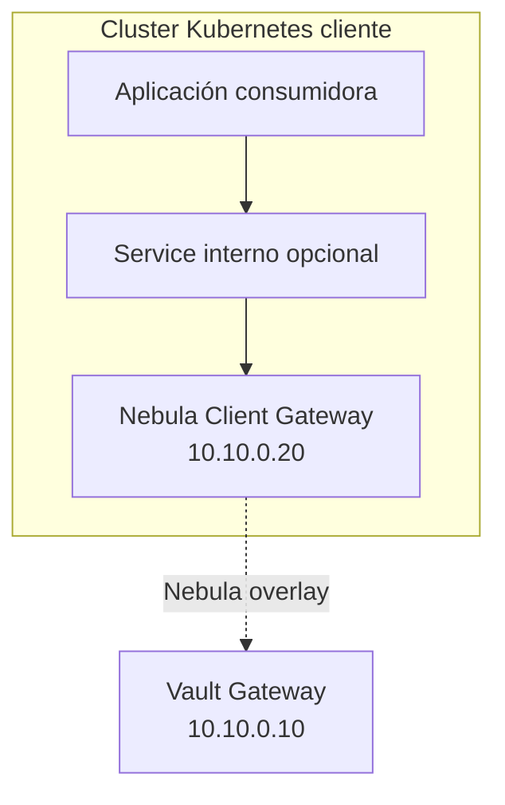

# Implementación de Nebula para acceso privado a Vault

## Arquitectura implementada

La arquitectura propuesta se compone de tres elementos principales:

1. **Lighthouse**
   - Ejecutado en una VM con IP pública estable.
   - Facilita el descubrimiento entre nodos Nebula.
   - No expone Vault ni actúa como proxy de aplicación.

2. **Vault Gateway**
   - Desplegado en el cluster donde se ejecuta Vault.
   - Participa en la red Nebula con una IP overlay propia.
   - Reenvía tráfico TCP hacia el Service interno de Vault.

3. **Client Gateway**
   - Ejecutado en el entorno cliente.
   - Puede estar inicialmente en una VM o posteriormente en otro cluster Kubernetes.
   - Permite que las aplicaciones cliente lleguen al Vault Gateway mediante la red overlay.



## Direccionamiento propuesto

Para el laboratorio se utiliza una red overlay privada dedicada a Nebula:

```text
Red overlay: 10.10.0.0/24
```

Asignación conceptual:

| Componente | IP overlay | Descripción |
|---|---:|---|
| Lighthouse | `10.10.0.1` | Nodo de descubrimiento |
| Vault Gateway | `10.10.0.10` | Gateway hacia Vault |
| Client Gateway | `10.10.0.20` | Gateway del consumidor |

Estas direcciones pertenecen únicamente a la red overlay de Nebula. No reemplazan las IP internas de Kubernetes ni las direcciones de la red física.

## Flujo de comunicación hacia Vault

Cuando una aplicación cliente requiere acceder a Vault, el flujo esperado es el siguiente:

1. La aplicación cliente envía la solicitud hacia el gateway cliente o directamente hacia la IP overlay del Vault Gateway.
2. Nebula utiliza el lighthouse para resolver la ubicación del Vault Gateway.
3. Se establece un túnel cifrado entre el Client Gateway y el Vault Gateway.
4. El Vault Gateway recibe el tráfico en la IP overlay `10.10.0.10`.
5. El proxy TCP reenvía la conexión hacia `vault.vault.svc.cluster.local:8200`.
6. Vault procesa la solicitud aplicando TLS, autenticación y políticas.
7. La respuesta retorna por el mismo canal privado.



## Integración con Vault

Vault permanece desplegado dentro del namespace correspondiente, por ejemplo `vault`, y se mantiene como un servicio interno de Kubernetes.

El gateway Nebula no sustituye los controles de Vault. Aunque el tráfico llegue por una red privada, Vault debe continuar aplicando:

- TLS en el listener.
- Validación de certificados.
- Autenticación de clientes.
- Políticas de acceso por aplicación.
- Auditoría de operaciones.

La comunicación privada mediante Nebula reduce la exposición de red, pero el acceso lógico a secretos sigue dependiendo de Vault.



## Despliegue del Vault Gateway en Kubernetes

El Vault Gateway puede desplegarse en un namespace dedicado, por ejemplo:

```bash
nebula
```

El patrón de despliegue utilizado incluye:

- Un `ServiceAccount` para el gateway.
- Un `ConfigMap` con la configuración de Nebula.
- Un `Secret` con el certificado y clave privada del nodo.
- Un `Deployment` con el contenedor de Nebula.
- Un contenedor auxiliar `socat` para reenviar tráfico TCP hacia Vault.

Estructura conceptual:

```text
namespace/nebula
├── serviceaccount.yaml
├── configmap-nebula-config.yaml
├── secret-nebula-certs.yaml
└── deployment-nebula-vault-gateway.yaml
```

El contenedor `nebula` levanta la red overlay, mientras que `socat` permite mapear el tráfico recibido en el gateway hacia el Service interno de Vault.

```bash
10.10.0.10:8200 -> vault.vault.svc.cluster.local:8200
```

## Patrón con contenedor auxiliar socat

El uso de `socat` permite desacoplar la conectividad overlay de Nebula del servicio interno de Kubernetes. Nebula recibe el tráfico en la IP privada overlay y el proxy TCP lo reenvía hacia Vault.



Este enfoque es útil porque Vault no necesita conocer directamente la red Nebula. Para Vault, la comunicación llega como tráfico normal dentro del cluster.


## Configuración del cliente

El lado cliente debe contar con su propio certificado Nebula y una configuración que le permita conectarse al lighthouse.

En una primera fase de laboratorio, el cliente puede ejecutarse en una máquina externa, WSL o VM. En una fase posterior, el mismo patrón puede trasladarse a un segundo cluster Kubernetes.

Ejemplo conceptual:

```text
Cliente externo / VM
  └── Nebula client
        └── IP overlay: 10.10.0.20
              └── Acceso a Vault Gateway: 10.10.0.10:8200
```

Cuando se implemente cluster-to-cluster, el cliente también puede tener un gateway interno similar al gateway de Vault.



## Reglas de firewall de Nebula

El firewall de Nebula debe permitir únicamente los flujos necesarios. En este caso, el Vault Gateway debería aceptar conexiones hacia el puerto `8200` solo desde los clientes autorizados.

Ejemplo conceptual:

```yaml
firewall:
  inbound:
    - port: 8200
      proto: tcp
      group: client

  outbound:
    - port: any
      proto: any
      host: any
```

Esta regla debe ajustarse según los grupos definidos en los certificados de Nebula. Si el certificado del cliente pertenece al grupo `client`, el gateway puede permitir únicamente a ese grupo el acceso al puerto de Vault.


## Relación con GitOps

Los manifiestos de Kubernetes del gateway pueden ser gestionados mediante GitOps. Sin embargo, debe distinguirse entre configuración versionable y material sensible.

Puede versionarse:


- Deployment
- ServiceAccount
- ConfigMap con configuración no sensible
- NetworkPolicies
- Documentación
- Valores de Helm no sensibles


No debe versionarse:

- Claves privadas
- Certificados con material sensible
- CA privada de Nebula
- Tokens
- Credenciales

En caso de requerir secretos dentro del cluster, estos deben manejarse mediante el mecanismo de gestión de secretos definido por la arquitectura (al menos cifrados como Secret), evitando almacenar material sensible directamente en Git.

## Consideraciones con certificados TLS de Vault

Si los clientes acceden a Vault usando un nombre diferente al Service interno original, ese nombre debe estar contemplado en el certificado TLS de Vault.

Por ejemplo, si el cliente consume Vault mediante un hostname asociado al gateway, el certificado de Vault debe incluir ese nombre en sus `dnsNames`.

Ejemplos de nombres que podrían requerirse según el diseño:

- vault
- vault.vault.svc
- vault.vault.svc.cluster.local
- vault-gateway.nebula.svc.cluster.local

Si el acceso se realiza directamente mediante IP overlay o mediante un nombre externo controlado, debe revisarse que el certificado TLS de Vault sea válido para esa forma de acceso.

En un entorno GitOps, este cambio debe realizarse modificando el recurso `Certificate` correspondiente y permitiendo que cert-manager emita un nuevo certificado.

## Validación de conectividad

La validación de la implementación puede realizarse por fases.

### 1. Validar conectividad Nebula

Comprobar que el cliente puede alcanzar la IP overlay del Vault Gateway (debe permitirse ICMP en las reglas de firewall Nebula):

```bash
ping 10.10.0.10
```

O validar conectividad TCP al puerto de Vault:

```bash
nc -vz 10.10.0.10 8200
```

### 2. Validar respuesta de Vault

Consultar el endpoint de salud de Vault a través del túnel privado:

```bash
curl --cacert ca.crt https://10.10.0.10:8200/v1/sys/health
```

Si se utiliza un hostname incluido en el certificado de Vault, se recomienda usar ese hostname en lugar de la IP.

### 3. Validar autenticación hacia Vault

Probar autenticación con certificado de cliente:

```bash
curl --cacert ca.crt \
  --cert client.crt \
  --key client.key \
  --request POST \
  --data '{"name":"curl-app"}' \
  https://vault-gateway.nebula.svc.cluster.local:8200/v1/auth/cert/login
```

### 4. Validar lectura de secretos

Una vez obtenido un token válido, validar acceso a un secreto permitido por política:

```bash
curl --cacert ca.crt \
  --header "X-Vault-Token: <TOKEN>" \
  https://vault-gateway.nebula.svc.cluster.local:8200/v1/kv/data/application/curl-app/test
```

## Problemas operativos observados

Durante pruebas de laboratorio, pueden presentarse problemas relacionados con NAT, puertos UDP o ejecución dentro de Kubernetes.

Algunos puntos a revisar son:

- Que el lighthouse sea alcanzable desde ambos nodos.
- Que cada nodo use un certificado distinto.
- Que no se reutilice el certificado del lighthouse en un cliente o gateway.
- Que la IP overlay definida en el certificado coincida con la configuración esperada.
- Que el pod tenga permisos suficientes para crear la interfaz de red si se ejecuta Nebula dentro de Kubernetes.
- Que el tráfico TCP hacia Vault sea reenviado correctamente por `socat`.
- Que el certificado TLS de Vault incluya el nombre usado por el cliente.


## Alcance de esta implementación

La implementación documentada representa una validación inicial de conectividad privada hacia Vault. Su propósito es demostrar que es posible acceder a Vault desde un entorno externo o cliente mediante una red overlay cifrada, sin exponer Vault públicamente.

El alcance puede evolucionar por fases (actualmente validado hasta fase 3):

| Fase | Descripción |
|---|---|
| Fase 1 | Cliente externo accede a Vault mediante Nebula |
| Fase 2 | Gateway Nebula desplegado dentro del cluster de Vault |
| Fase 3 | Gateway Nebula desplegado también en el cluster cliente |
| Fase 4 | Integración completa cluster-to-cluster |
| Fase 5 | Automatización y rotación controlada de certificados |
