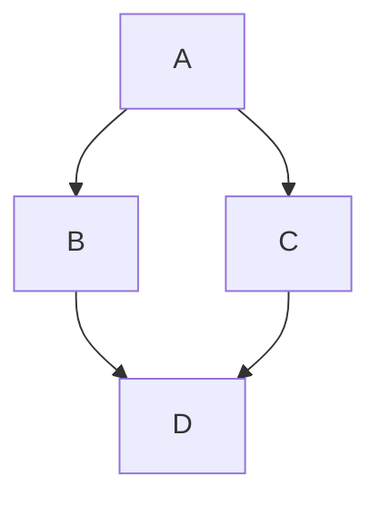

# Arquitectura de la Plataforma

## Introducción

Este documento describe la arquitectura de referencia de la plataforma
de aplicaciones basada en Kubernetes. El objetivo es proporcionar un
modelo estándar para el despliegue seguro, escalable y automatizado
de aplicaciones.

La plataforma se basa en los siguientes componentes principales:

- Kubernetes como plataforma de orquestación
- Vault para gestión de secretos
- cert-manager para gestión de certificados
- GitOps para despliegue declarativo

---

## Principios de Arquitectura

Los principios que guían el diseño de la plataforma son:

- **Seguridad por defecto**
- **Automatización completa**
- **Infraestructura declarativa**
- **Rotación automática de credenciales**

---

## Componentes Principales

### Kubernetes

La plataforma ejecuta aplicaciones dentro de un clúster Kubernetes
gestionado por el equipo de plataforma.

Responsabilidades principales:

- Orquestación de contenedores
- Networking interno
- Gestión de workloads
- Escalabilidad automática

### Gestión de Secretos

Los secretos de aplicación son gestionados centralmente mediante Vault.

Las aplicaciones se autentican usando certificados emitidos por
cert-manager y autenticación mTLS.

---

## Flujo de Autenticación

El siguiente diagrama muestra cómo una aplicación obtiene acceso
a secretos en Vault utilizando certificados.



## Ejemplo de código

## Ejemplo de script

```bash
#!/bin/bash

VAULT_ADDR="https://vault.internal"

curl \
  --cert client.crt \
  --key client.key \
  --cacert ca.crt \
  $VAULT_ADDR/v1/secret/data/app
```