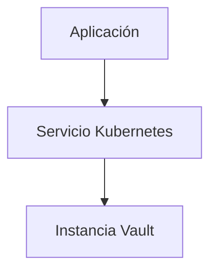
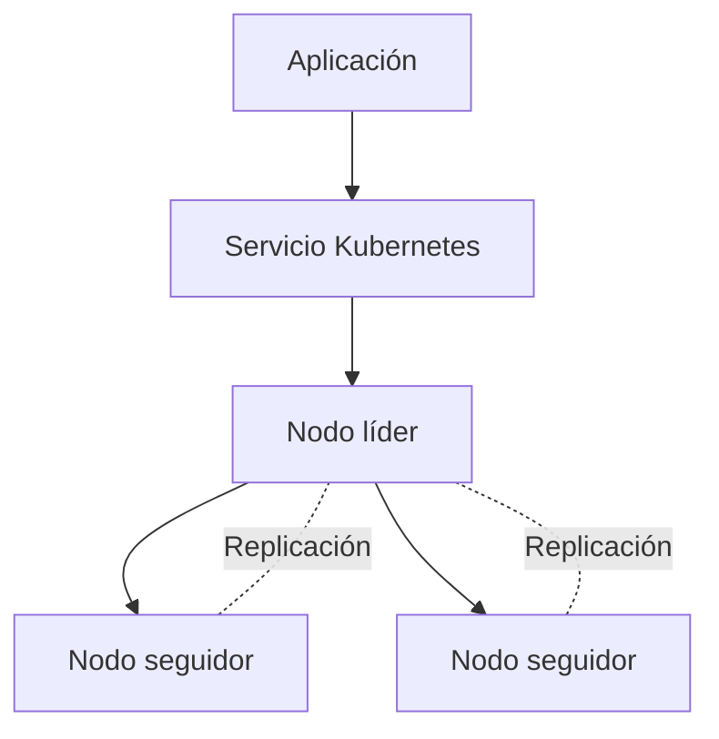
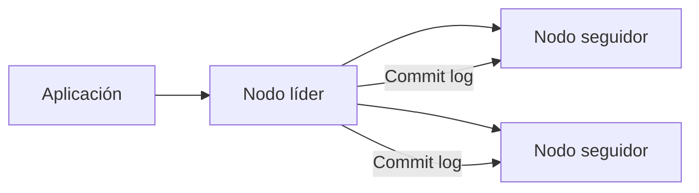
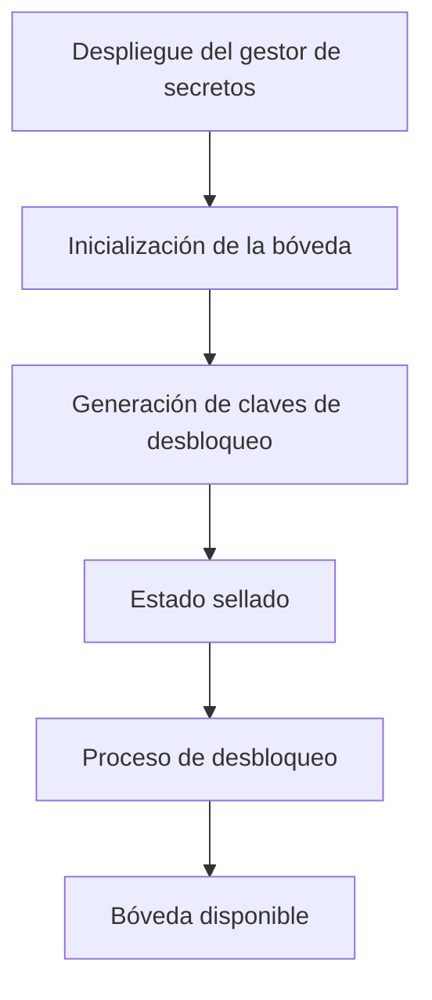
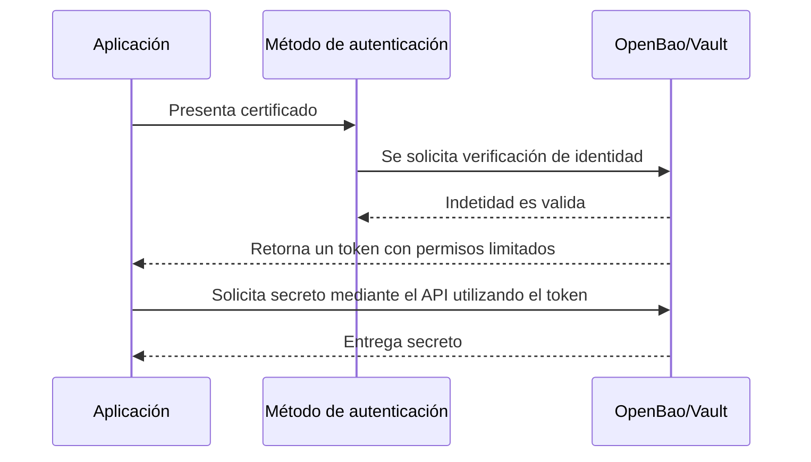
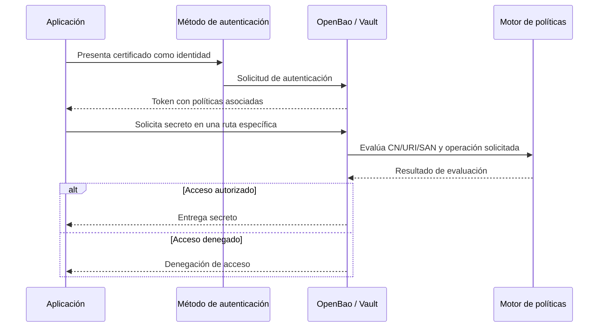

# Implementación de vault

La implementación del gestor de secretos tiene como objetivo desacoplar la administración de credenciales del clúster, archivos de configuración e incluso el repositorio de git, centralizando su almacenamiento, distribución de y control de identidad en un solo componente dedicado. Para este fin se utiliza HashiCorpVault y/o OpenBao.

La configuración del gestor de secretos incluye mecanismos de comunicación segura mediante TLS, definición de rutas para almacenamiento de secretos y habilitación de métodos de autenticación tanto para workloads dentro de entornos Kuberetes como para aplicaciones externas. Así mismo se establecen políticas de acceso orientado a limitar el consumo de secretos de acuerdo con el principio de mínimo privilegio.

Junto a la automatización de su despliegue, este enfoque permite que las aplicaciones no dependan de almacenamiento estático de credenciales dentro del clúster, sino de una recuperación dinámica y controlada de la información sensible requerida en un entorno que redujo la curva de aprendizaje y complejidad que requiere la implementación del mismo.


## Despliegue del servicio

Referenciando al apartado de bootstrap, la aplicación de ArgoCD correspondiente a vault instala la base de este componente mediante Helm Charts y un archivo values.yaml personalizable para su configuración inicial. Dentro de este mismo se configuran propiedades como: 

<ul>
<li>High Avaibility (HA) con un nodo por defecto pero ajustable al deseable</li>
<li>Tipo y cantidad de almacenamiento como raft</li>
<li>Definición de uso obligatorio de TLS</li>
<li>Definición y montaje de certificados para TLS</li>
<li>Definición de CA para métodos de autenticación como cert auth</li>
<li>Limitación de recursos</li>
</ul>

## Implementación de TLS 

Como se menciona anteriormente, vault posee una opción para definir TLS obligatorio, sin embargo, para esto es necesario poseer un certificado válido. Para el caso de esta implementación, se utiliza una CA root e intermediaria propia offline para firmar certificados válidos y utilizables dentro de vault.

Los certificados son manejados por Cert-Manager, por lo que el uso de una CA pública o enterprise puede ser utilizada haciendo los ajustes necesarios, sin embargo, esta configuración y distribución de certificados se detalla en el apartado de dicho componente.


La definición de TLS se hace sobre el documento values.yaml de vault con las siguientes configuraciones:

```yaml
global:
  tlsDisable: false
```

```hcl
        listener "tcp" {
          address     = "0.0.0.0:8200"
          cluster_address = "0.0.0.0:8201"

          tls_cert_file = "/vault/ssl/tls.crt"
          tls_key_file = "/vault/ssl/tls.key"
          
          tls_client_ca_file = "/vault/ssl/ca.crt"
          tls_disable_client_certs = "false"
        }
```

```yaml
  volumes:
    - name: vault-tls
      secret:
        secretName: vault-tls
        defaultMode: 0400

  volumeMounts:
    - name: vault-tls
      mountPath: /vault/ssl
      readOnly: true
```

La ruta /vault/ssl/* es donde se monta el certificado TLS para esta implementación, sin embargo, no hay restricción sobre la misma. En cuanto al certificado, este se monta como un secret dentro de la ruta definida para el uso del componente de gestión de secretos, la definición del certificado utilizado en esta implementación base es:

```yaml
apiVersion: cert-manager.io/v1
kind: Certificate
metadata:
  name: vault-server-cert
  namespace: vault
  annotations:
    argocd.argoproj.io/sync-wave: "2"
spec:
  secretName: vault-tls
  issuerRef:
    name: vault-ca-issuer
    kind: ClusterIssuer
  commonName: vault.vault.svc.cluster.local
  dnsNames:
    - vault
    - vault.vault
    - vault.vault.svc
    - vault.vault.svc.cluster.local
    - https://127.0.0.1
  ipAddresses: 
    - 127.0.0.1
  privateKey:
    algorithm: RSA
    size: 2048
```

## Implementación de High Avaiability

La implementación de alta disponibilidad (High Availability, HA) en el gestor de secretos se configuró con el objetivo de establecer una arquitectura resiliente, capaz de tolerar fallos y garantizar la continuidad del servicio dentro del entorno Kubernetes. Dado que el gestor de secretos constituye un componente crítico para la operación del sistema, su disponibilidad resulta fundamental para el correcto funcionamiento de los mecanismos de autenticación y acceso a credenciales.

Para este fin, se utilizó el modo de despliegue en alta disponibilidad proporcionado por el chart oficial del gestor de secretos, habilitando la configuración distribuida mediante el uso de almacenamiento integrado basado en Raft.

### Configuración aplicada

La configuración del sistema se definió mediante un archivo values.yaml, en el cual se habilitó el modo HA y el almacenamiento distribuido:

``` yaml
ha:
  enabled: true
  replicas: 1
  raft:
    enabled: true
    setNodeId: true
```

Adicionalmente, se configuró el uso de almacenamiento persistente:

``` yaml
dataStorage:
  enabled: true
  size: 1Gi
```

La comunicación entre nodos y clientes se aseguró mediante TLS:

```hcl
listener "tcp" {
  address = "0.0.0.0:8200"
  cluster_address = "0.0.0.0:8201"

  tls_cert_file = "/vault/ssl/tls.crt"
  tls_key_file = "/vault/ssl/tls.key"
  
  tls_client_ca_file = "/vault/ssl/ca.crt"
  tls_disable_client_certs = "false"
}
```

Esta configuración permite:

- Asegurar comunicaciones cifradas

- Habilitar autenticación basada en certificados (mTLS)

- Establecer una base para un clúster distribuido

!!! nota
    En el entorno de implementación, la configuración se ejecutó con una única réplica, lo cual limita el comportamiento completo de alta disponibilidad. No obstante, la configuración se encuentra preparada para escalar a múltiples nodos, permitiendo validar el modelo de arquitectura propuesto.

### Flujo de operación actual listo para escalar



En el escenario implementado, las solicitudes de las aplicaciones son dirigidas hacia el servicio expuesto en Kubernetes, el cual enruta el tráfico hacia la instancia disponible del gestor de secretos.

En un escenario completo de alta disponibilidad, múltiples instancias participarían en el clúster, permitiendo la elección automática de un nodo líder y la continuidad del servicio ante fallos.

### Escenario completo de alta disponibilidad.



Las solicitudes de las aplicaciones son dirigidas al servicio del clúster, el cual distribuye el tráfico hacia las instancias disponibles. Las operaciones son procesadas por el nodo líder, mientras que los nodos seguidores mantienen una copia del estado actual.

En caso de fallo, uno de los nodos seguidores tomará su rol de manera automática, garantizando la continuidad del servicio sin intervención manual.

### Consideraciones de diseño para HA

La configuración adoptada permite establecer una base compatible con alta disponibilidad, integrando almacenamiento persistente, comunicación segura y mecanismos de orquestación propios de Kubernetes. Aunque la implementación se realizó con una única réplica, el diseño es escalable y se alinea con los principios de resiliencia definidos en la arquitectura de referencia.

## Implementación de Raft

El almacenamiento distribuido del gestor de secretos se implementó utilizando el backend integrado basado en el protocolo Raft, el cual permite mantener la consistencia del estado entre múltiples nodos sin depender de sistemas externos de persistencia.

Raft es un algoritmo de consenso diseñado para sistemas distribuidos, que coordina múltiples nodos mediante la elección de un líder responsable de procesar operaciones de escritura y replicar los cambios hacia los nodos seguidores.

### Configuración aplicada

El backend de almacenamiento se definió de la siguiente manera:

```hcl
storage "raft" {
  path = "/vault/data"
}
```

Además, se configuró el registro del servicio dentro del clúster Kubernetes:

```hcl
service_registration "kubernetes" {}
```

Esta configuración permite:

- Persistencia de datos en cada nodo

- Integración nativa con Kubernetes

- Base para replicación distribuida

### Flujo de consenso y replicación



En un escenario completo de múltiples nodos, todas las operaciones de escritura son dirigidas al nodo líder. Este nodo registra los cambios en un log distribuido y los replica hacia los nodos seguidores. Una vez que la mayoría de los nodos confirma la operación, el cambio se considera comprometido (committed).

Este proceso garantiza que todos los nodos mantengan un estado consistente, incluso en escenarios donde uno o más nodos fallen.

En el entorno implementado, al existir una única réplica, el nodo actúa de forma autónoma, manteniendo el estado local sin necesidad de replicación. Sin embargo, la configuración se encuentra preparada para escalar a un clúster distribuido.

### Consideraciones de diseño

El uso de Raft como backend de almacenamiento permite simplificar la arquitectura al eliminar la dependencia de sistemas externos y proporciona un mecanismo robusto de consistencia y replicación. Este enfoque mejora la portabilidad del sistema y facilita su despliegue en entornos Kubernetes bajo un modelo GitOps.

## Inicialización de la bóveda

Una vez desplegado el componente de gestión de secretos en el clúster, es necesario realizar el proceso de inicialización de la bóveda. Dicho proceso corresponde a la fase inicial de configuración del sistema y tiene como objetivo establecer mecanismos criptográficos que permiten proteger el contenido almacenado en el mismo.

El comando utilizado para inicializar la bóveda es:

```bash
vault operator init
```

El cúal genera una salida como: 

```bash
Unseal Key 1: key1
Unseal Key 2: key2
Unseal Key 3: key3
Unseal Key 4: key4
Unseal Key 5: key5
```

Tras inicializar la bóveda, esta permanece en un estado sellado hasta que se realiza el proceso de desbloqueo mediante el uso de las claves generadas durante la etapa anterior. Este mecanismo garantiza que el acceso al contenido protegido requiera la participación obligatoria de operadores autorizados. 

Esta etapa del proceso se logra introduciendo tres de las cinco llaves generadas y utilizando el comando:

```bash
vault operator unseal
```

!!! nota
    Es importante almacenar las llaves y token generados al utilizar el comando init, ya que cada vez que el pod de vault se reinicie por cualquier motivo, el estado pasará nuevamente a sealed, por lo que aunque no es necesario hacer init nuevamente, se debe desbloquear la bóveda nuevamente. Para esto existen mecanismos de auto unseal que no se presentan de momento en esta implementación.

Una vez completado el proceso de desbloqueo, el sistema queda disponible para la configuración de políticas de acceso, métodos de autenticación y almacenamiento de secretos para las aplicaciones.

### Flujo final de inicialización

<center>


</center>

## Método de autenticación

La autenticación es uno de los elementos más importantes de la implementación del gestor de secretos, ya que este define la forma en la que aplicaciones o entidades demuestran su identidad antes de obtener información sensible. 

Dado que la arquitectura propuesta busca minimizar la confianza implícita entre componentes y restringir el acceso a secretos con base en identidades verificables, el método debe permitir establecer una relación clara entre cada entidad y los permisos correspondientes a la misma.

### Criterios de selección método de autenticación.

La elección del método de autenticación se basó principalmente en los siguientes criterios:

<ul>
<li>Entorno en el que se encuentra el aplicativo que consume el servicio (Servidores en premisas, cloud o el mismo clúster)</li>
<li>Capacidad de asociar identidades con políticas</li>
<li>Reducción del uso de credenciales estáticas</li>
<li>Alineación de método con principios Zero Trust</li>
</ul>

Bajo estos criterios, se priorizó el método de autorización que permitiera autenticar aplicativos que se encuentren tanto dentro como fuera del clúster, priorizando el acceso y solicitudes de secretos mediante la API expuesta por vault antes que otros métodos como el montaje de secretos dentro del clúster o el uso de ServiceAccounts.

### Método de autenticación implementado

Para el caso de esta implementación, se decidió utilizar "cert auth" como medio de autenticación entre aplicativos o entornos con la boveda, ya que funciona nativamente con la API de vault y no está restringida al entorno en el que el aplicativo consumidor de secretos se encuentre.

Este método está basado en el uso de certificados digitales con el objetivo de establecer una relación de confianza explicita entre el consumidor y el gestor de secretos. Este enfoque permite generar una identidad única a cada consumidor, aplicar políticas y restricciones únicas, y verificar la misma a través de la autoridad confiable del sistema.

El uso de autenticación basada en certificados se alinea de forma más directa con principios de Zero Trust, debo a que el acceso no depende de una ubicación de red ni de la pertenencia al clúster, sino de la validación explicita de una identidad criptográfica.

Bajo este modelo, un aplicativo consumidor presenta su certificado al gestor de secretos, el cual verifica la cadena de confianza, válida los atributos definidos para la identidad y en caso de ser autorizado, emite un token con permisos limitados basado en las políticas asociadas a dicha identidad.

<center>



</center>

## Organización de secretos

Es importante definir una manera lógica en la cual estructurar el almacenamiento de datos sensibles en el gestor de secretos, ya que una organización coherente facilita la administración de acceso, vinculación de identidades a espacios de secretos y reduce la exposición innecesaria de dicha información.

Si bien existen distintas formas de organizar los secretos dentro de la bóveda, para esta implementación se decidió utilizar una estructura jerárquica que permite la separación de información según la aplicación que la consume. Este enfoque facilita la aplicación de políticas de acceso específicas a una identidad y evita el acceso a rutas compartidas donde no es necesario, aplicando una restricción granular sobre los espacios a la que cada una puede acceder.

Un ejemplo de estructura de almacenamiento jerárquico descrito anteriormente se muestra a continuación:

```text
kv/ 
 ├── application/ 
 │    ├── payment-ms/
 │    │    ├── secret_1 
 │    │    └── billing-api-key 
 │    ├── billing-ms/ 
 │    │    └── secret_2 
 │    │    └── payment-api-key
```

En este caso, con la aplicación de identidad y políticas correctas, el micro servicio payment puede acceder a los secretos secret_1 y al billing-api-key, sin embargo, aunque billing se encuentre bajo la misma ruta application, este no puede acceder a los secretos de payment-ms, solamente a los de billing-ms. Bajo la aplicación de políticas y este tipo de organización, se busca restringir todo el acceso a una identidad, y luego definir únicamente a que puede acceder.

## Políticas de acceso.

Las políticas de acceso son el principal mecanismo mediante el cual se controla la interacción entre identidades de las aplicaciones y los secretos almacenados, ya que definen de manera explícita qué operaciones puede realizar la identidad asociada sobre las rutas específicas dentro del sistema.

En la implantación propuesta, se espera que las políticas sigan el principio de mínimo privilegio, el cual establece que cada aplicación debe contar únicamente con los permisos estrictamente necesarios para cumplir su función.

La definición de políticas se realiza utilizando reglas que especifican rutas de acceso y capacidades permitidas. Estas capacidades determinan las operaciones que una identidad puede ejecutar sobre los secretos almacenados, tales como lectura, creación, actualización o listado.

Continuando con el ejemplo de la sección anterior, las políticas definidas para cada servicio se verían de la siguiente manera:
- payment-ms

```hcl
path "kv/data/application/payment-ms/*" {
  capabilities = ["read", "update"]
}
```

- billing-ms 

```hcl
path "kv/data/application/payment-ms/*" {
  capabilities = ["read", "update", "list"]
}
```

Y con estas definiciones es suficiente para que se aplique el mínimo privilegio al restringir implícitamente el acceso a cualquier otra ruta, segmentando lógicamente el almacenamiento del gestor de secretos garantizando que cada aplicación opere dentro de un ámbito de permisos claramente definidos. Además, estas políticas pueden mantenerse bajo control de versiones como parte de configuración del sistema dentro de GitOps y el repositorio como fuente de la verdad.

## Asociación de políticas

Al utilizar Cert-Auth, es necesario asociar el certificado como identidad a una política especifica aplicada a la bóveda, de esta manera el token que se genere cuando se dé el proceso de autenticación, tendrá habilitadas las acciones correspondientes para dicha identidad.

Una política se puede crear con el siguiente comando (el EOF puede ser reemplazado por un archivo con extensión hcl)

```bash

vault policy write payment-policy - <<'EOF'

path "kv/data/application/payment-ms/*" {
  capabilities = ["read", "update"]
}

EOF

```

Y su asociación se realiza mediante el comando: 

```bash
vault write auth/cert/certs/payment-ms \
  display_name="payment-ms" \
  policies="payment-policy" \
  certificate=@/vault/ssl/ca.crt \
  allowed_common_names="payment-ms" \
  ttl="1h"
```

Donde:
- policies es el nombre de la política creada anteriormente.
- certificate es la CA que se utilizará para validar la firma de los certificados.
- allowed_common_names es el método  seleccionado en este ejemplo como medio de identificación del certificado, por lo que vault comprobará la firma y el campo definido para asociarlos.
- ttl es el Time To Live del token a generar, por lo que después de ese tiempo, es necesario autenticarse de nuevo.

!!! nota
    Es posible utilizar uno o más campos del certificado como el DNS SAN, URI SAN, EMAIL SAN, Organization, entre otros. 

    Por otro lado, también se puede usar el certificado como tal para la relación de identidad, por lo que utilizaría el fingerprint del mismo, sin embargo, cada vez que el certificado del cliente expire será necesario aplicar las políticas nuevamente, contrario al uso de cualquiera de las propiedades descritas, el cual permite el funcionamiento continuo de la definición de la asociación incluso cuando el certificado se renueva.

## Flujo final

A continuación se presenta un diagrama con el flujo de autorización y validación de políticas dentro de Vault.

