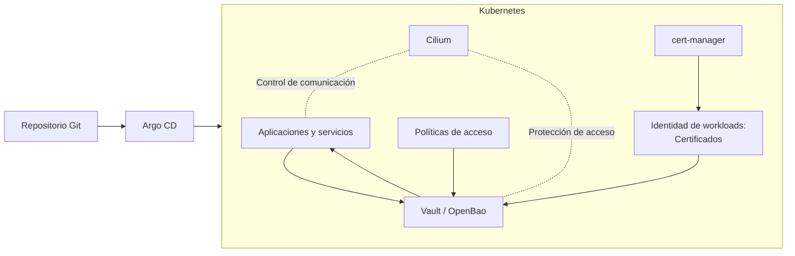

# Implementación de gestor de secretos

Este proyecto tiene como propósito presentar un marco de referencia base para la gestión sencilla, automatizada y segura de secretos basada en un entorno de Kubernetes, utilizando principios de GitOps, Zero Trust y automatización de configuraciones e infraestructura de manera declarativa.

En este contexto, la seguridad y gestión de la comunicación entre servicios constituye un elemento clave dentro de arquitecturas distribuidas. Existen diferentes enfoques para abordar este problema, como el uso de service mesh, los cuales permiten gestionar el tráfico entre servicios mediante proxies y control centralizado. Sin embargo, estos mecanismos pueden introducir sobrecarga operativa y de rendimiento debido a la incorporación de componentes intermediarios en la comunicación.

Como alternativa, el uso de tecnologías basadas en eBPF permite implementar controles de red, observabilidad y seguridad directamente en el kernel del sistema operativo, reduciendo la necesidad de intermediarios y mejorando la eficiencia en el procesamiento del tráfico. Este enfoque resulta particularmente adecuado para entornos Kubernetes que requieren alto rendimiento, escalabilidad y control granular de las comunicaciones entre workloads.

## Problema abordado

En entornos Kubernetes tradicionales, la gestión de secretos (si no se implementa otro servicio) depende del recurso nativo Secret, el cual no proporciona mecanismos suficientes para garantizar procesos como control granular de acceso (se comparte a nivel de namespace), auditoria, rotación segura y trazabilidad sin exposición. 

Lo mismo sucede en aplicaciones web que almacenan información sensible en archivos de configuración que podrían verse expuestos fácilmente por un simple error como incluirlos en el repositorio de git.

Muchas veces los mecanismos anteriormente descritos son utilizados por distintas razones como falta de interés en manejo de secretos, curva de aprendizaje grande para la implementación de servicios de terceros, costos elevados o prioridad de gastos e incluso por desconocimiento de los riesgos que el uso de dichos mecanismos implica. 

Por esto es importante crear una plataforma sencilla de implementar que permita tener un control más  seguro de la información sensible y que esté al alcance de organizaciones en distintos contextos como por ejemplo instituciones gubernamentales que carezcan de este tipo de controles y Pymes.

Para más detalles sobre el contexto y problema puede dirigirse [aquí](01-introduccion/contexto.md)

## Propuesta del proyecto

El marco de referencia propuesto integra múltiples capas tecnológicas con el objetivo de establecer un modelo estructurado para la administración segura de información sensible. Esto junto a la implementación de referencia buscar poner a disposición una plataforma de gestión de secretos accesible y sencilla de implementar que incluya los siguientes componentes:

- Automatización declarativa de infraestructura escalable mediante GitOps.
- Control de identidad.
- Gestión centralizada de secretos y a disposición mediante una API.
- Segmentación de workloads basado en principios Zero Trust.
- Control de acceso basado en mínimo privilegio.

## Alcance del proyecto

Este proyecto se enfoca en:

- El diseño base de un marco de referencia para la gestión segura de secretos mediante una plataforma basada en automatización y principios Zero Trust.
- Implementación práctica base del modelo.
- Evaluación de su viabilidad técnica comparada con otras integraciones similares.

El objetivo del proyecto no es reemplazar herramientas existentes, sino demostrar que la integración estructurada de tecnologías ampliamente utilizadas, combinada con enfoques de automatización y seguridad, permite construir una plataforma de gestión de secretos replicable y adaptable a distintos contextos organizacionales, reduciendo la complejidad operativa asociada a su implementación.

## Arquitectura base

La arquitectura de implementación basada en los principios expuestos por el marco de referencia, se organiza alrededor de un clúster de Kubernetes como plataforma de orquestación principal. Sobre dicho entorno se despliegan los componentes encargados de automatización (motor de GitOps), seguridad de la red (Cilium), gestión de identidad (Cert-Manager) y la administración centralizada de secretos (Vault/OpenBao).

En este modelo, ArgoCD sincroniza la infraestructura declarativa definida en git (fuente de la verdad), Cert-Manager administra la identidad para servicios de TLS y autenticación de clientes hacia vault mediante la generación de certificados, Cilium aplica controles de segmentación, comunicación y politicas de red, y Vaul/OpenBao actúa como el sistema central de la gestión de secretos y políticas de acceso.

## Principales componentes

| Componente      | Función                                |
| :---------------: | :--------------------------------------: |
| Kubernetes      | Plataforma de orquestación             |
| Argo CD         | Automatización GitOps                  |
| Cilium          | Seguridad de red y microsegmentación   |
| OpenBao / Vault | Gestión centralizada de secretos       |
| cert-manager    | Gestión de certificados                |
| Git             | Fuente de verdad de la infraestructura |

## Estructura de la documentación

La documentación se organiza en las siguientes secciones y propósitos.

| Sección             | Contenido                            |
| ------------------- | ------------------------------------ |
| Introducción        | Contexto, problema y objetivos       |
| Fundamentos         | Bases conceptuales del proyecto      |
| Análisis            | Evaluación de riesgos y herramientas |
| Marco de referencia | Arquitectura y modelo propuesto      |
| Implementación      | Descripción de la solución aplicada  |
| Validación          | Evaluación del modelo implementado   |
| Conclusiones        | Resultados y trabajo futuro          |